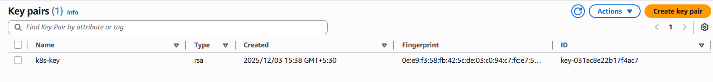
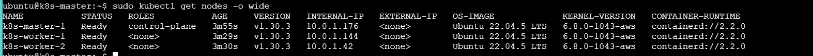

# Automated Kubernetes Cluster on AWS

Automated deployment of a production-ready Kubernetes cluster on AWS using Terraform, kubeadm, and Calico CNI.

## 🎯 Overview

This project provisions a fully functional Kubernetes cluster with:
- **1 Master Node** (control-plane) - t3.medium
- **2 Worker Nodes** - t3.medium
- **Calico CNI** for pod networking
- **Automatic worker join** via HTTP-based self-service mechanism
- **Complete automation** - no manual intervention required

## 📋 Prerequisites

- **Terraform** v1.0+ ([Download](https://www.terraform.io/downloads))
- **AWS Account** with appropriate permissions
- **AWS CLI** configured with credentials
- **SSH Key Pair** for EC2 access

## 🏗️ Architecture

```
┌─────────────────────────────────────────────────────┐
│                    VPC (10.0.0.0/16)                │
│  ┌───────────────────────────────────────────────┐  │
│  │         Subnet (10.0.1.0/24)                  │  │
│  │                                               │  │
│  │  ┌──────────────┐                            │  │
│  │  │ Master Node  │  HTTP Server :8080         │  │
│  │  │ k8s-master-1 │  ────────────────┐         │  │
│  │  │ 10.0.1.X     │                  │         │  │
│  │  └──────────────┘                  │         │  │
│  │         │                           │         │  │
│  │         │ Calico CNI                │         │  │
│  │         │ (192.168.0.0/16)          │         │  │
│  │         │                           │         │  │
│  │  ┌──────┴────────┐           ┌─────▼──────┐  │  │
│  │  │  Worker-1     │           │  Worker-2  │  │  │
│  │  │ k8s-worker-1  │           │k8s-worker-2│  │  │
│  │  │ 10.0.1.Y      │           │ 10.0.1.Z   │  │  │
│  │  └───────────────┘           └────────────┘  │  │
│  └───────────────────────────────────────────────┘  │
└─────────────────────────────────────────────────────┘
```

### Network Configuration

| Component | CIDR | Purpose |
|-----------|------|---------|
| VPC | 10.0.0.0/16 | AWS Virtual Private Cloud |
| Subnet | 10.0.1.0/24 | EC2 instance network |
| Pod Network | 192.168.0.0/16 | Kubernetes pod IPs (Calico) |

## 🚀 Quick Start

### 1. Clone and Configure

```bash
cd c:\Users\Bharat Bhushan\Documents\Terraform\learning-terraform

# Review and update variables if needed
# Edit terraform.tfvars or use default values
```

### 2. Initialize Terraform

```bash
terraform init
```

### 3. Deploy the Cluster

```bash
terraform apply
```

Type `yes` when prompted.

**Deployment Time**: ~12-15 minutes
- Master setup: 7-10 minutes
- Worker join: 2-3 minutes
  


### 4. Access the Cluster

Get the master node public IP from Terraform output:

```bash
ssh -i k8s-key.pem ubuntu@<MASTER_PUBLIC_IP>



# Set KUBECONFIG
export KUBECONFIG=/etc/kubernetes/admin.conf

# Verify cluster
kubectl get nodes
```


**Expected Output**:
```
NAME            STATUS   ROLES           AGE   VERSION
k8s-master-1    Ready    control-plane   10m   v1.30.3
k8s-worker-1    Ready    <none>          8m    v1.30.3
k8s-worker-2    Ready    <none>          8m    v1.30.3
```

## 📁 Project Structure

```
learning-terraform/
├── main.tf                 # Root module
├── variables.tf            # Input variables
├── outputs.tf              # Output values
├── terraform.tfvars        # Variable values
├── k8s-key.pem            # SSH private key (generated)
├── modules/
│   ├── vpc/
│   │   ├── main.tf        # VPC, subnet, IGW, route table
│   │   ├── variables.tf
│   │   └── outputs.tf
│   ├── sec_group/
│   │   ├── main.tf        # Security groups for master & workers
│   │   ├── variables.tf
│   │   └── outputs.tf
│   └── ec2/
│       ├── main.tf        # EC2 instances
│       ├── variables.tf
│       ├── outputs.tf
│       ├── k8s-master.sh  # Master node setup script
│       └── k8s-worker.sh  # Worker node setup script
```

## 🔄 Deployment Workflow

### Master Node Setup (`k8s-master.sh`)

1. **System Preparation**
   - Update packages
   - Install containerd runtime
   - Configure kernel modules and sysctl

2. **Kubernetes Installation**
   - Install kubeadm, kubelet, kubectl (v1.30.3)
   - Install crictl

3. **Cluster Initialization**
   ```bash
   kubeadm init --pod-network-cidr=192.168.0.0/16 --node-name=k8s-master-1
   ```

4. **Calico CNI Installation**
   ```bash
   kubectl apply -f https://raw.githubusercontent.com/projectcalico/calico/v3.27.0/manifests/calico.yaml
   ```

5. **Join Command Distribution**
   - Generate join command: `kubeadm token create --print-join-command`
   - Save to: `/tmp/join-command.sh`
   - Start HTTP server: `python3 -m http.server 8080 --bind 0.0.0.0`

### Worker Node Setup (`k8s-worker.sh`)

1. **System Preparation**
   - Same as master (containerd, kernel modules, etc.)

2. **Kubernetes Installation**
   - Install kubeadm, kubelet, kubectl, crictl

3. **Automatic Cluster Join**
   - Poll master HTTP server: `http://<master-ip>:8080/join-command.sh`
   - Retry every 10 seconds (max 60 attempts = 10 minutes)
   - Execute join command when available
   - Join cluster automatically

## ✅ Verification Checkpoints

### Checkpoint 1: Terraform Apply Success

```bash
# Check Terraform output
terraform output

# Should show:
# master_public_ip = "x.x.x.x"
# worker_public_ips = ["y.y.y.y", "z.z.z.z"]
```


### Checkpoint 2: Master Node Ready

```bash
ssh -i k8s-key.pem ubuntu@<MASTER_PUBLIC_IP>
export KUBECONFIG=/etc/kubernetes/admin.conf

# Check master status
kubectl get nodes
# k8s-master-1 should show "Ready"

# Check master setup log
tail -50 /var/log/k8s-master-setup.log
# Should end with "HTTP server started"
```

### Checkpoint 3: Calico Running

```bash
# Check Calico pods
kubectl get pods -n kube-system | grep calico

# Expected output:
# calico-kube-controllers-xxx   1/1     Running
# calico-node-xxx               1/1     Running  (one per node)
```

### Checkpoint 4: HTTP Server Active

```bash
# Check HTTP server
ps aux | grep "python3 -m http.server"

# Test locally
curl http://localhost:8080/join-command.sh
# Should return the kubeadm join command
```

### Checkpoint 5: Workers Joined

```bash
# Watch workers join
kubectl get nodes --watch

# All nodes should show "Ready" within 2-3 minutes
```

### Checkpoint 6: Network Routing

```bash
# Verify no routing conflicts
ip route show | grep "10.0.1"

# Should only show:
# 10.0.1.0/24 dev ens5 proto kernel scope link src 10.0.1.X
# (NO Calico routes for 10.0.1.0/24)
```

## 🧪 Testing the Cluster

### Deploy Test Application

```bash
# Create nginx deployment
kubectl create deployment nginx --image=nginx --replicas=3

# Expose as NodePort service
kubectl expose deployment nginx --port=80 --type=NodePort

# Check pod distribution
kubectl get pods -o wide
# Pods should be distributed across all nodes

# Get service details
kubectl get svc nginx
# Note the NodePort (e.g., 30080)

# Test access (from master)
curl http://localhost:<NodePort>
```

### Verify Pod Networking

```bash
# Get pod IPs
kubectl get pods -o wide

# Exec into a pod
kubectl exec -it <pod-name> -- /bin/bash

# Ping another pod
ping <another-pod-ip>
# Should work (Calico networking)
```

## 🔧 Troubleshooting

### Workers Not Joining

**Check worker logs**:
```bash
ssh -i k8s-key.pem ubuntu@<WORKER_PUBLIC_IP>
tail -100 /var/log/k8s-worker-setup.log
```

**Look for**:
- "Successfully fetched join command from master!"
- "Successfully joined the cluster!"

**If stuck**, check:
1. Master HTTP server is running
2. Security group allows port 8080
3. Workers can reach master IP

### Nodes Show NotReady

**Check Calico**:
```bash
kubectl get pods -n kube-system | grep calico
# All should be Running

# Check specific pod logs
kubectl logs -n kube-system <calico-pod-name>
```

**Check kubelet**:
```bash
# On the NotReady node
sudo systemctl status kubelet
sudo journalctl -u kubelet -n 50
```

### Routing Conflicts

**Symptom**: Nodes go Ready → NotReady

**Check routes**:
```bash
ip route show | grep "10.0.1"
```

**If you see Calico routes for 10.0.1.0/24**, the pod CIDR is conflicting. Verify:
```bash
kubectl get nodes -o jsonpath='{.items[0].spec.podCIDR}'
# Should be 192.168.x.x, NOT 10.0.1.x
```

## 🧹 Cleanup

### Destroy the Cluster

```bash
terraform destroy
```

Type `yes` when prompted.

**This will delete**:
- All EC2 instances
- VPC and networking resources
- Security groups

**Note**: The SSH key file (`k8s-key.pem`) will remain on your local machine.

## 💰 Cost Estimation

| Resource | Type | Quantity | Cost/Hour | Cost/Month |
|----------|------|----------|-----------|------------|
| Master | t3.medium | 1 | $0.0416 | ~$30 |
| Workers | t3.medium | 2 | $0.0832 | ~$60 |
| **Total** | | | **$0.1248** | **~$90** |

*Costs are approximate and may vary by region.*

## 🔐 Security Considerations

### Security Groups

**Master Node**:
- SSH (22): Open to 0.0.0.0/0
- API Server (6443): Open to 0.0.0.0/0
- HTTP Server (8080): VPC only (10.0.0.0/16)
- Kubelet (10250): VPC only
- All traffic from VPC: Allowed

**Worker Nodes**:
- SSH (22): Open to 0.0.0.0/0
- Kubelet (10250): VPC only
- NodePort (30000-32767): Open to 0.0.0.0/0
- All traffic from VPC: Allowed

### Best Practices

1. **Restrict SSH**: Change security group to allow SSH only from your IP
2. **Use Bastion Host**: For production, use a bastion host for SSH access
3. **Enable RBAC**: Kubernetes RBAC is enabled by default
4. **Rotate Tokens**: Kubeadm tokens expire after 24 hours
5. **Use TLS**: All Kubernetes components use TLS

## 📚 Key Features

### ✅ Fully Automated
- No manual intervention required
- Workers join automatically via HTTP
- Complete setup in ~15 minutes

### ✅ Self-Healing
- Workers retry join if master not ready
- Robust error handling with `|| true`
- Detailed logging for troubleshooting

### ✅ Production-Ready
- Calico CNI for reliable networking
- No routing conflicts with VPC
- Proper pod CIDR configuration

### ✅ Simple & Clean
- No complex Terraform provisioners
- HTTP-based join mechanism
- Easy to understand and modify

## 🛠️ Customization

### Change Instance Types

Edit `terraform.tfvars`:
```hcl
master_instance_type = "t3.large"
worker_instance_type = "t3.large"
```

### Change Worker Count

Edit `modules/ec2/main.tf`:
```hcl
resource "aws_instance" "k8s_worker" {
  count = 3  # Change from 2 to 3
  ...
}
```

### Change Kubernetes Version

Edit `k8s-master.sh` and `k8s-worker.sh`:
```bash
sudo apt-get install -y kubelet=1.31.0-1.1 kubeadm=1.31.0-1.1 kubectl=1.31.0-1.1
```

## 📖 Additional Resources

- [Kubernetes Documentation](https://kubernetes.io/docs/)
- [Calico Documentation](https://docs.tigera.io/calico/latest/about/)
- [Terraform AWS Provider](https://registry.terraform.io/providers/hashicorp/aws/latest/docs)
- [kubeadm Documentation](https://kubernetes.io/docs/setup/production-environment/tools/kubeadm/)

## 🤝 Contributing

Feel free to submit issues and enhancement requests!

## 📝 License

This project is open source and available under the MIT License.

---

**Happy Kubernetes Clustering! 🚀**

