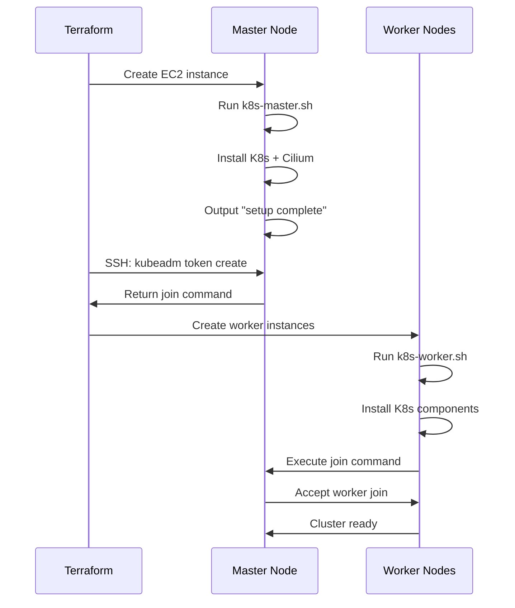

# Kubernetes Cluster on AWS with Terraform

This project automates the deployment of a production-ready Kubernetes cluster on AWS using Terraform. The cluster consists of 1 master node and 2 worker nodes, with Cilium as the CNI (Container Network Interface) plugin.

## Architecture

```
┌─────────────────────────────────────────────────────────────┐
│                         AWS VPC                              │
│  ┌───────────────────────────────────────────────────────┐  │
│  │                    Public Subnet                       │  │
│  │                                                        │  │
│  │  ┌──────────────┐                                     │  │
│  │  │              │                                     │  │
│  │  │ K8s Master   │  ← Cilium CNI                      │  │
│  │  │ (t3.medium)  │  ← Control Plane                   │  │
│  │  │              │                                     │  │
│  │  └──────┬───────┘                                     │  │
│  │         │                                             │  │
│  │         │ Join Command                                │  │
│  │         ├──────────────┬──────────────┐              │  │
│  │         │              │              │              │  │
│  │  ┌──────▼──────┐ ┌────▼──────┐ ┌────▼──────┐       │  │
│  │  │             │ │           │ │           │       │  │
│  │  │ K8s Worker  │ │K8s Worker │ │           │       │  │
│  │  │ 1           │ │2          │ │           │       │  │
│  │  │ (t3.medium) │ │(t3.medium)│ │           │       │  │
│  │  │             │ │           │ │           │       │  │
│  │  └─────────────┘ └───────────┘ └───────────┘       │  │
│  │                                                        │  │
│  └───────────────────────────────────────────────────────┘  │
│                                                              │
│  Internet Gateway                                            │
└─────────────────────────────────────────────────────────────┘
```

## Features

- ✅ **Automated Cluster Setup**: Complete Kubernetes cluster deployment with one command
- ✅ **Cilium CNI**: Modern eBPF-based networking and security
- ✅ **High Availability Ready**: Architecture supports scaling to multiple masters
- ✅ **Security Groups**: Properly configured firewall rules for master and worker nodes
- ✅ **Automatic Node Join**: Workers automatically join the cluster using kubeadm
- ✅ **Version Pinning**: Kubernetes v1.30.3 with version-locked components

## Prerequisites

- **Terraform**: v1.0 or higher
- **AWS Account**: With appropriate permissions to create VPC, EC2, and networking resources
- **AWS CLI**: Configured with credentials
- **SSH Client**: For accessing nodes (optional, for troubleshooting)

## Project Structure

```
learning-terraform/
├── main.tf                    # Root module - orchestrates all resources
├── variables.tf               # Input variables
├── outputs.tf                 # Output values (optional)
├── terraform.tfvars          # Variable values (create this)
├── k8s-key.pem               # SSH private key (auto-generated)
├── README.md                 # This file
│
└── modules/
    ├── vpc/                  # VPC and networking
    │   ├── main.tf
    │   └── output.tf
    │
    ├── sec_group/            # Security groups
    │   ├── main.tf
    │   └── outputs.tf
    │
    ├── key_pair/             # SSH key pair
    │   ├── main.tf
    │   └── outputs.tf
    │
    └── ec2/                  # EC2 instances and setup scripts
        ├── main.tf
        ├── outputs.tf
        ├── k8s-master.sh     # Master node initialization script
        ├── k8s-worker.sh     # Worker node setup script
        └── join-command.sh   # Generated join command (auto-created)
```

## Quick Start

### 1. Clone and Navigate

```bash
cd learning-terraform
```

### 2. Initialize Terraform

```bash
terraform init
```

### 3. Review the Plan

```bash
terraform plan
```

### 4. Deploy the Cluster

```bash
terraform apply
```

Type `yes` when prompted. The deployment takes approximately **15-20 minutes**.

### 5. Access the Cluster

After deployment completes, SSH into the master node:

```bash
# Get the master node public IP from Terraform output or AWS console
ssh -i k8s-key.pem ubuntu@<MASTER_PUBLIC_IP>

# Verify cluster status
kubectl get nodes

# Check all pods
kubectl get pods -A

# Verify Cilium
cilium status
```

## What Gets Deployed

### Master Node
- **Instance Type**: t3.medium (2 vCPU, 4GB RAM)
- **Components**:
  - Kubernetes control plane (API server, controller manager, scheduler)
  - etcd (cluster state database)
  - Cilium CNI plugin
  - kubelet, kubeadm, kubectl v1.30.3
  - containerd runtime

### Worker Nodes (x2)
- **Instance Type**: t3.medium (2 vCPU, 4GB RAM)
- **Components**:
  - kubelet, kubeadm, kubectl v1.30.3
  - containerd runtime
  - Automatically joins cluster via kubeadm

### Networking
- **VPC**: 10.0.0.0/16
- **Subnet**: 10.0.1.0/24 (public)
- **Pod Network**: 192.168.0.0/16 (Cilium)
- **Security Groups**: 
  - Master: Ports 6443, 2379-2380, 10250-10252
  - Worker: Ports 10250, 30000-32767

## Configuration

### Master Node Setup (`k8s-master.sh`)

The master initialization script performs:
1. System updates and prerequisite installation
2. Containerd installation and configuration
3. Kubernetes components installation (v1.30.3)
4. Cluster initialization with `kubeadm init`
5. Cilium CNI installation
6. Join command generation for workers

### Worker Node Setup (`k8s-worker.sh`)

The worker setup script performs:
1. System updates and prerequisite installation
2. Containerd installation and configuration
3. Kubernetes components installation (v1.30.3)
4. Automatic cluster join using the join command from master

## Deployment Flow



## Verification

### Check Node Status

```bash
kubectl get nodes -o wide
```

Expected output:
```
NAME           STATUS   ROLES           AGE   VERSION
k8s-master     Ready    control-plane   10m   v1.30.3
k8s-worker-1   Ready    <none>          5m    v1.30.3
k8s-worker-2   Ready    <none>          5m    v1.30.3
```

### Check System Pods

```bash
kubectl get pods -A
```

All pods in `kube-system` namespace should be `Running`.

### Verify Cilium

```bash
cilium status
```

Should show all components as "OK".

### Deploy Test Application

```bash
# Create a test deployment
kubectl create deployment nginx --image=nginx --replicas=3

# Expose it
kubectl expose deployment nginx --port=80 --type=NodePort

# Check pods distribution
kubectl get pods -o wide

# Get service details
kubectl get svc nginx
```

## Troubleshooting

### Master Node Logs

```bash
ssh -i k8s-key.pem ubuntu@<MASTER_IP>
tail -f /var/log/k8s-master-setup.log
```

### Worker Node Logs

```bash
ssh -i k8s-key.pem ubuntu@<WORKER_IP>
tail -f /var/log/k8s-worker-setup.log
```

### Common Issues

#### Workers Not Joining

1. Check if join command was generated:
   ```bash
   cat modules/ec2/join-command.sh
   ```

2. Manually join if needed:
   ```bash
   # On master
   sudo kubeadm token create --print-join-command
   
   # Copy output and run on worker
   sudo <join-command>
   ```

#### Cilium Not Installing

1. Check KUBECONFIG is set:
   ```bash
   export KUBECONFIG=/etc/kubernetes/admin.conf
   cilium status
   ```

2. Reinstall if needed:
   ```bash
   cilium install
   cilium status --wait
   ```

#### Pods Not Starting

1. Check kubelet status:
   ```bash
   sudo systemctl status kubelet
   sudo journalctl -u kubelet -f
   ```

2. Check containerd:
   ```bash
   sudo systemctl status containerd
   ```

## Cleanup

To destroy all resources:

```bash
terraform destroy
```

Type `yes` when prompted. This will delete:
- All EC2 instances
- Security groups
- VPC and networking components
- SSH key pair

**Note**: The local `k8s-key.pem` file will remain - delete it manually if needed.

## Cost Estimation

Approximate AWS costs (us-east-1 region):
- **Master Node** (t3.medium): ~$0.0416/hour
- **Worker Nodes** (2x t3.medium): ~$0.0832/hour
- **Data Transfer**: Minimal for testing
- **Total**: ~$0.125/hour or **~$90/month** if running 24/7

**Recommendation**: Destroy resources when not in use to minimize costs.

## Customization

### Change Instance Types

Edit `modules/ec2/main.tf`:
```hcl
instance_type = "t3.large"  # Change from t3.medium
```

### Add More Workers

Edit `modules/ec2/main.tf`:
```hcl
resource "aws_instance" "k8s_worker" {
  count = 3  # Change from 2
  ...
}
```

### Change Kubernetes Version

Edit both `k8s-master.sh` and `k8s-worker.sh`:
```bash
sudo apt-get install -y kubelet=1.31.0-1.1 kubeadm=1.31.0-1.1 kubectl=1.31.0-1.1
```

And in `k8s-master.sh`:
```bash
sudo kubeadm init --kubernetes-version 1.31.0 ...
```

## Security Considerations

- 🔒 **SSH Keys**: Keep `k8s-key.pem` secure and never commit to version control
- 🔒 **Security Groups**: Currently allows all traffic within VPC - restrict as needed
- 🔒 **Public IPs**: Nodes have public IPs for easy access - use private subnets for production
- 🔒 **RBAC**: Configure Kubernetes RBAC for production workloads
- 🔒 **Secrets**: Use AWS Secrets Manager or Kubernetes secrets for sensitive data

## Next Steps

1. **Install Ingress Controller**: 
   ```bash
   kubectl apply -f https://raw.githubusercontent.com/kubernetes/ingress-nginx/main/deploy/static/provider/cloud/deploy.yaml
   ```

2. **Install Metrics Server**:
   ```bash
   kubectl apply -f https://github.com/kubernetes-sigs/metrics-server/releases/latest/download/components.yaml
   ```

3. **Setup Monitoring**: Install Prometheus and Grafana

4. **Configure Storage**: Setup persistent volumes with AWS EBS

5. **CI/CD Integration**: Connect to GitHub Actions or Jenkins

## References

- [Kubernetes Documentation](https://kubernetes.io/docs/)
- [Cilium Documentation](https://docs.cilium.io/)
- [Terraform AWS Provider](https://registry.terraform.io/providers/hashicorp/aws/latest/docs)
- [kubeadm Documentation](https://kubernetes.io/docs/setup/production-environment/tools/kubeadm/)

## License

This project is for educational purposes.

## Support

For issues or questions:
1. Check the troubleshooting section above
2. Review logs on master/worker nodes
3. Consult Kubernetes and Terraform documentation

---

**Happy Kubernetes Clustering! 🚀**
